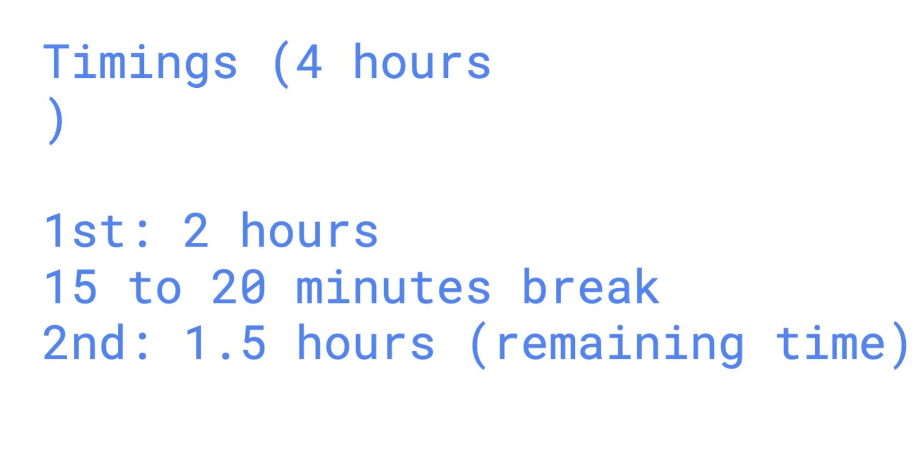

# Model deployment options 

### locally on laptops with and without GPU 

### OLLama
[click_here](https://github.com/ollama/ollama?tab=readme-ov-file)

# Fine-Tuning Methods for Foundation Models

## High-Level Training Methods

### 1. Self-Supervised Learning
- **Description:** Utilizes unlabeled data to generate supervisory signals through pretext tasks.
- **Examples:** Predicting the next word in a sentence, filling in masked words, solving jigsaw puzzles for images.
- **Use Case:** Large amounts of unlabeled data, initial pre-training phase.

### 2. Supervised Learning
- **Description:** Utilizes labeled data where each input has a corresponding output.
- **Examples:** Text classification, object detection, sentiment analysis.
- **Use Case:** Adequate labeled data available for specific tasks.

### 3. Reinforcement Learning
- **Description:** Learning by interacting with an environment to maximize cumulative rewards.
- **Examples:** Game playing, robotic control, recommendation systems.
- **Use Case:** Sequential decision-making tasks, environments with clear reward signals.

## Specific Fine-Tuning Techniques

### 1. Full Fine-Tuning
- **Description:** Fine-tuning all parameters of the pre-trained model on the task-specific dataset.
- **Relation:** Typically falls under supervised learning as it requires labeled data.

### 2. Feature-Based Fine-Tuning
- **Description:** Using the pre-trained model as a feature extractor and only training additional layers on top.
- **Relation:** Can be part of supervised learning but with reduced computational cost and risk of overfitting.

### 3. Layer-Wise Fine-Tuning
- **Description:** Gradually fine-tuning layers starting from the top and moving down.
- **Relation:** A strategy within supervised learning to manage computational resources and overfitting.

### 4. Transfer Learning with Domain Adaptation
- **Description:** Fine-tuning on a related domain-specific dataset before the task-specific dataset.
- **Relation:** Can combine both supervised and self-supervised learning phases.

### 5. Adversarial Training
- **Description:** Incorporating adversarial examples to improve robustness.
- **Relation:** Enhances supervised learning by adding adversarial self-supervised components.

### 6. Data Augmentation
- **Description:** Artificially increasing dataset size through transformations.
- **Relation:** Enhances supervised learning by providing more diverse training examples.

### 7. Knowledge Distillation
- **Description:** Training a smaller model to replicate the outputs of a larger model.
- **Relation:** Typically follows a supervised learning approach for both teacher and student models.

### 8. Low-Rank Adaptation (LoRA)
- **Description:** Fine-tuning additional low-rank matrices without changing the original weights significantly.
- **Relation:** A technique within supervised learning that reduces computational cost.

## Summary of Differences

- **Level of Abstraction:** High-level methods (self-supervised, supervised, reinforcement learning) are broad strategies or paradigms for learning, while detailed techniques (full fine-tuning, feature-based fine-tuning, etc.) are specific methods or strategies used within those paradigms.
- **Context of Use:** High-level methods describe the type of learning and data used, while the specific techniques provide practical steps and strategies for implementing fine-tuning.
- **Combination:** The high-level methods can encompass multiple specific techniques. For example, supervised learning can include full fine-tuning, feature-based fine-tuning, and others. Similarly, self-supervised learning can involve different pretext tasks for initial pre-training.

### Combining Both Perspectives

Understanding both the high-level learning methods and the specific fine-tuning techniques allows for a comprehensive approach to model training and adaptation:

1. **Self-Supervised Learning:**
   - Pre-train a foundation model using self-supervised methods (e.g., masked language modeling).
   - Fine-tune the model using supervised learning techniques (e.g., full fine-tuning or feature-based fine-tuning).

2. **Supervised Learning:**
   - Directly fine-tune the pre-trained model on labeled task-specific data using techniques like full fine-tuning or layer-wise fine-tuning.

3. **Reinforcement Learning:**
   - Pre-train or fine-tune the model using reinforcement learning for tasks requiring interaction with an environment.
   - Optionally combine with supervised learning for initial training or policy refinement.

By integrating these methods and techniques, you can effectively leverage foundation models for a wide range of applications and data scenarios.

## Training time 

