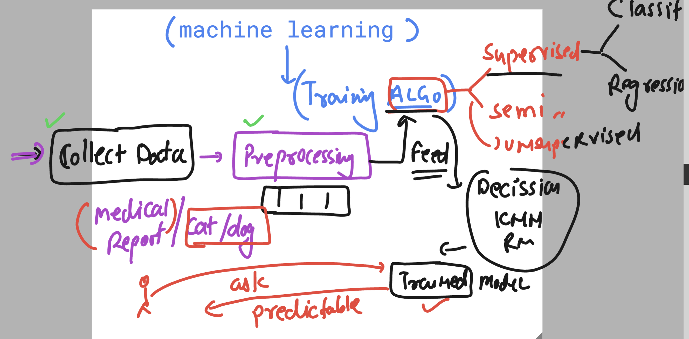
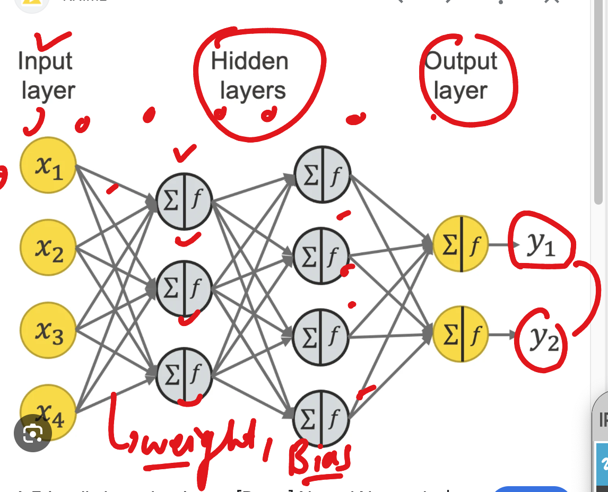
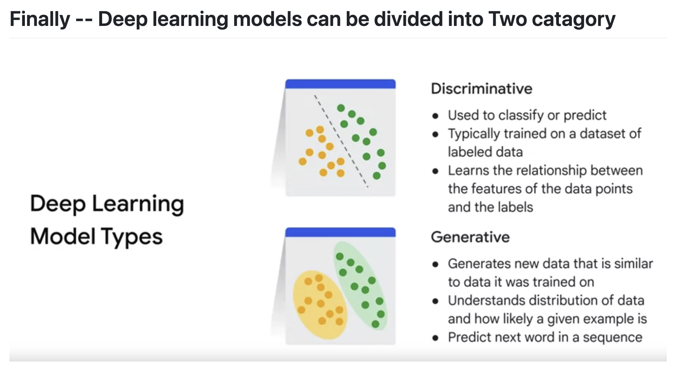
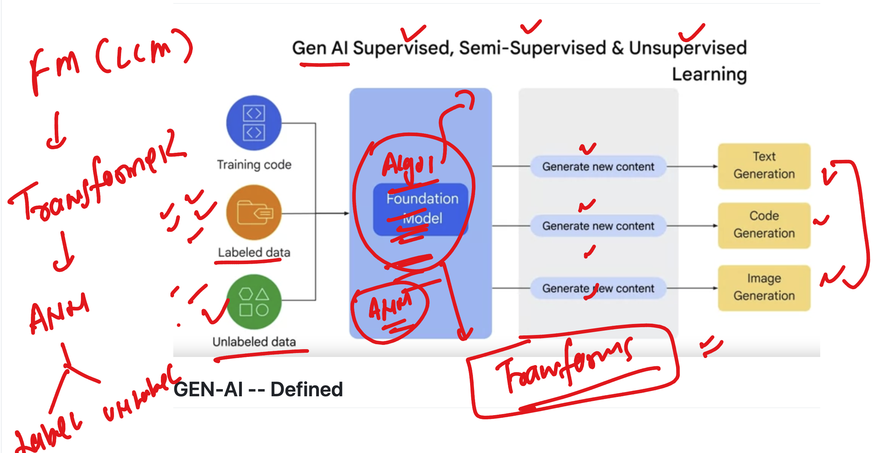
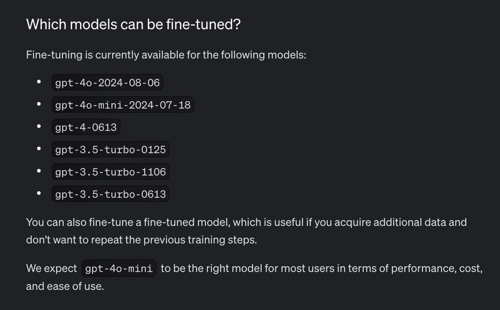
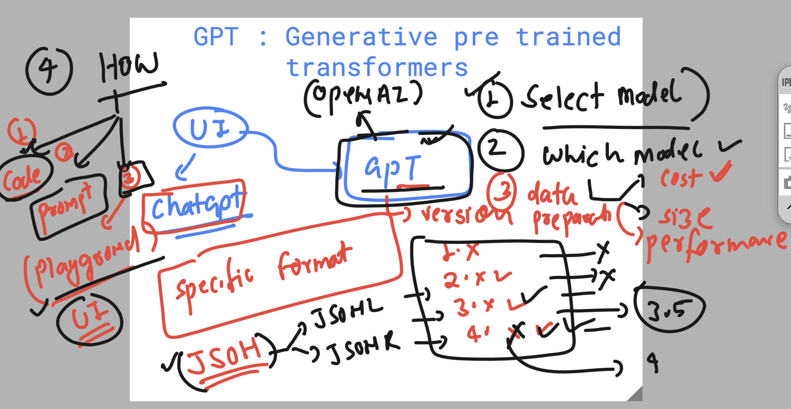
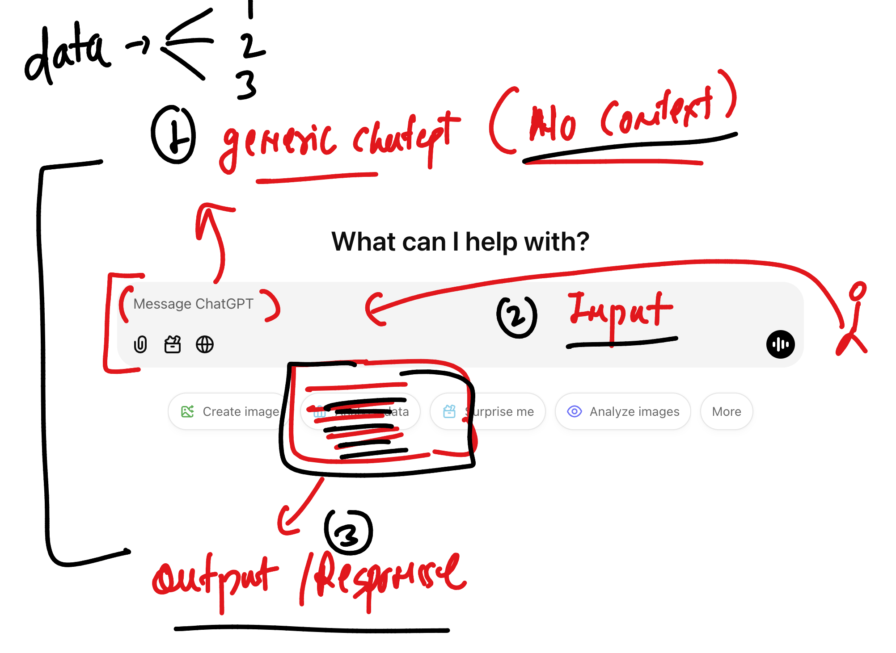
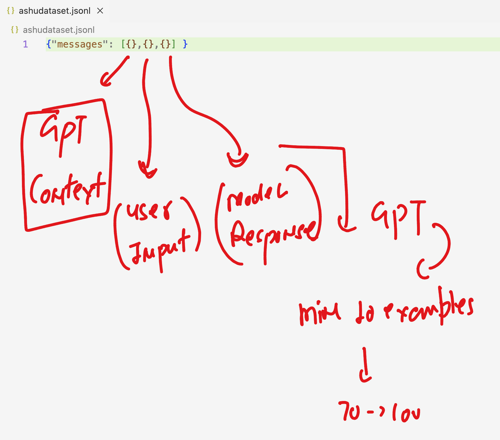
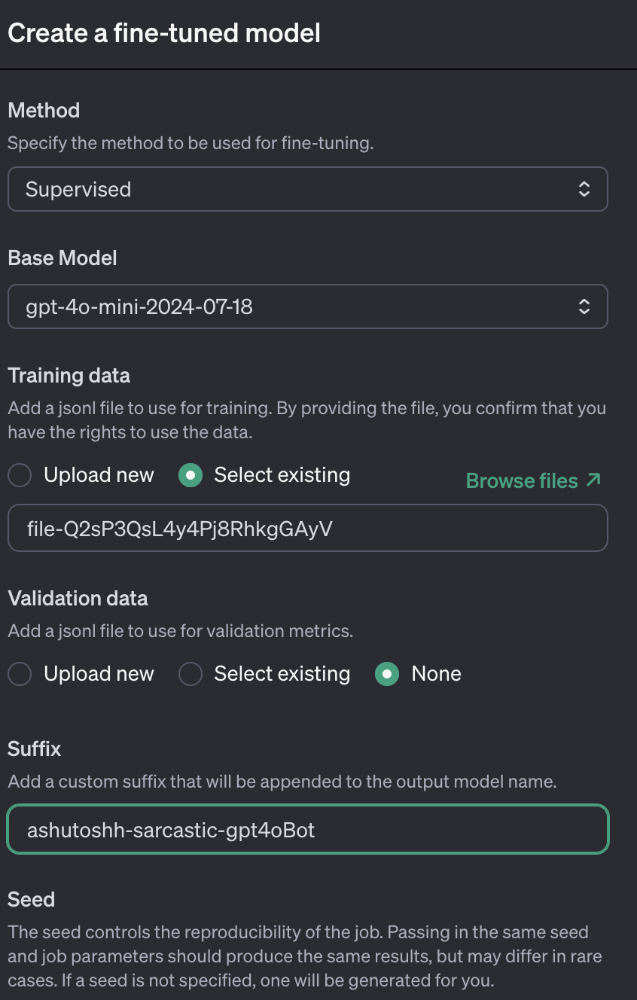
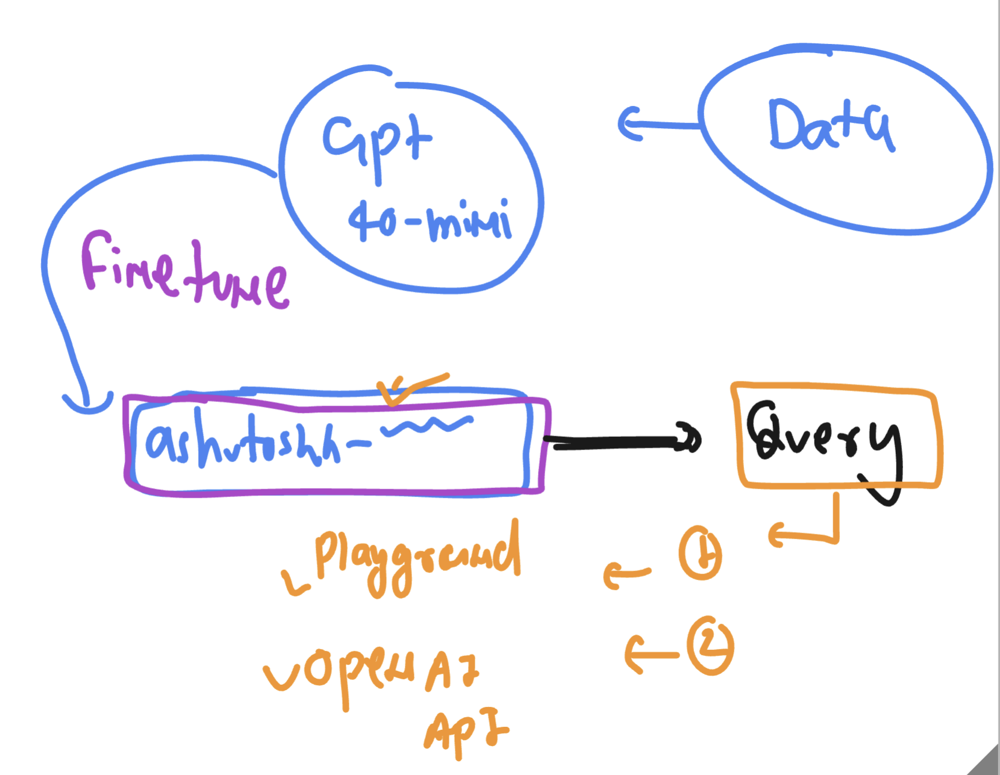

### Before we fine tune LLM's -- > things we need to know 


### a generic ML flow for training algo to any specific data 



### to increase more accuracy and reduce loss ML->DL (NN)



### Deep learning model types 



### bit more info about FM 



## GPT fine tuning -- 

### open link 
[click_here](https://platform.openai.com/docs/overview)

### in general not all FM are available for fine tuning 



### overall things to know for fine tuning of FM 



### gpt fine tuning data preparation 



### sample data format understanding 




### GPT model fine tuning using platform openai dashboard 




### to do query to a fine tuned model 



### Google colab 
## storage from driver + os from google cloud 

### installing openai in colab 

```
!pip install openai==1.59.9
```

