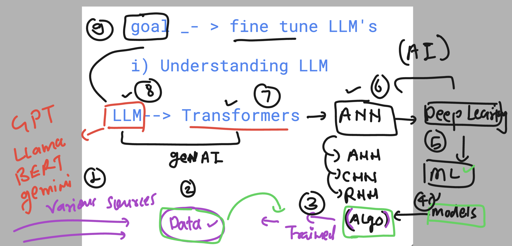

### Before we fine tune LLM's -- > things we need to know 

### a generic ML flow for training algo to any specific data 

### to increase more accuracy and reduce loss ML->DL (NN)

### Deep learning model types 

### bit more info about FM 

