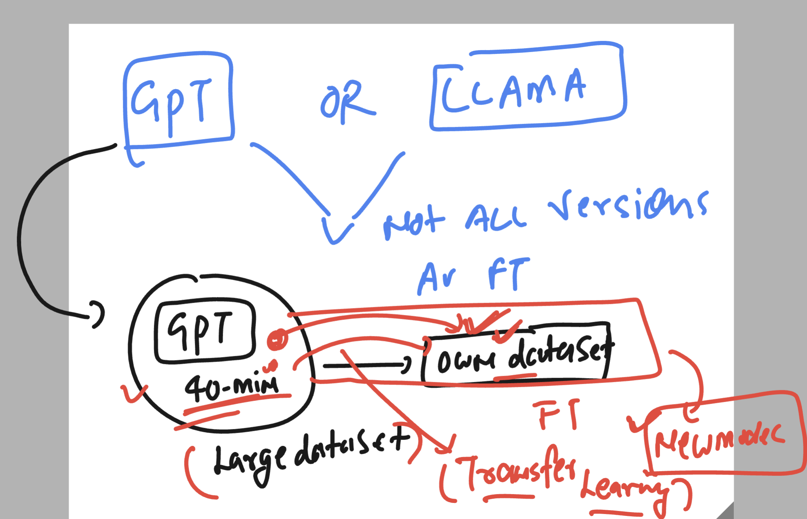
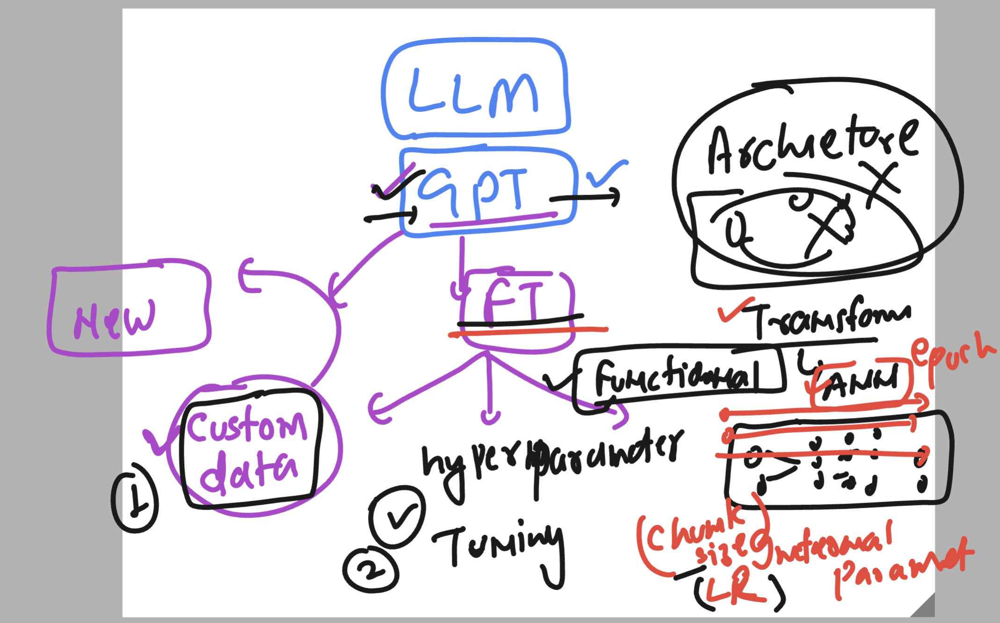

## Basic revision 



### Hyperparameter tunning 



### Mindset of Deploying app in cloud platforms to access fine tuned model 


## creating Venv using python 

```
ashu@ip-172-31-79-44:~/ashu_model_deploy$ ls
query.py
ashu@ip-172-31-79-44:~/ashu_model_deploy$ python3  -m  venv  ashu-env 
ashu@ip-172-31-79-44:~/ashu_model_deploy$ ls
ashu-env  query.py
ashu@ip-172-31-79-44:~/ashu_model_deploy$ 
ashu@ip-172-31-79-44:~/ashu_model_deploy$ source  ashu-env/bin/activate
(ashu-env) ashu@ip-172-31-79-44:~/ashu_model_deploy$ 
(ashu-env) ashu@ip-172-31-79-44:~/ashu_model_deploy$ 
(ashu-env) ashu@ip-172-31-79-44:~/ashu_model_deploy$ 

```

### installing openai 

```
(ashu-env) ashu@ip-172-31-79-44:~/ashu_model_deploy$ pip install openai 
Collecting openai
  Using cached openai-1.59.9-py3-none-any.whl (455 kB)
Collecting httpx<1,>=0.23.0
  Using cached httpx-0.28.1-py3-none-any.whl (73 kB)
Collecting tqdm>4
  Using cached tqdm-4.67.1-py3-none-any.wh

```
