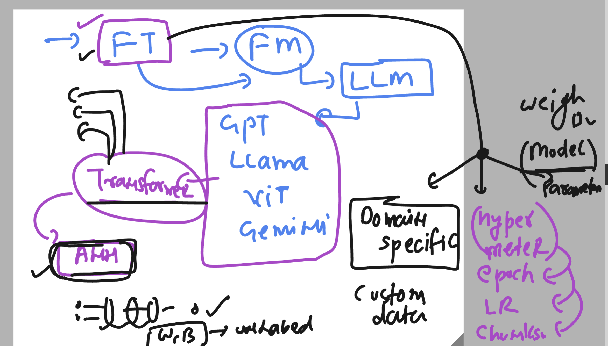
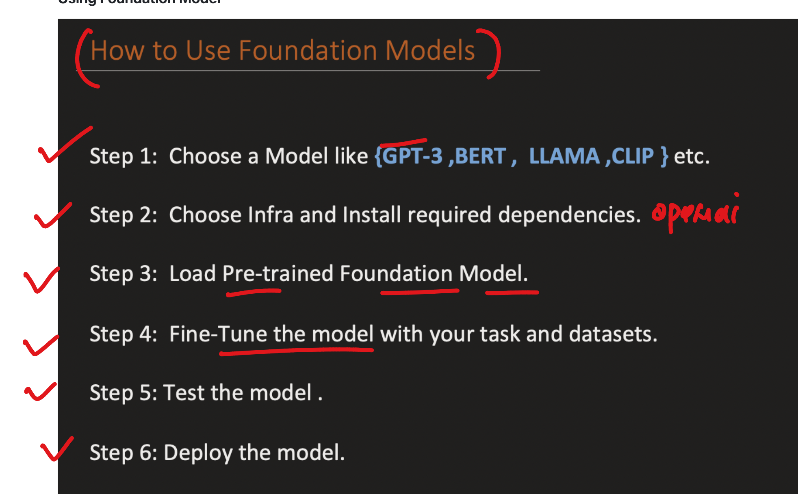
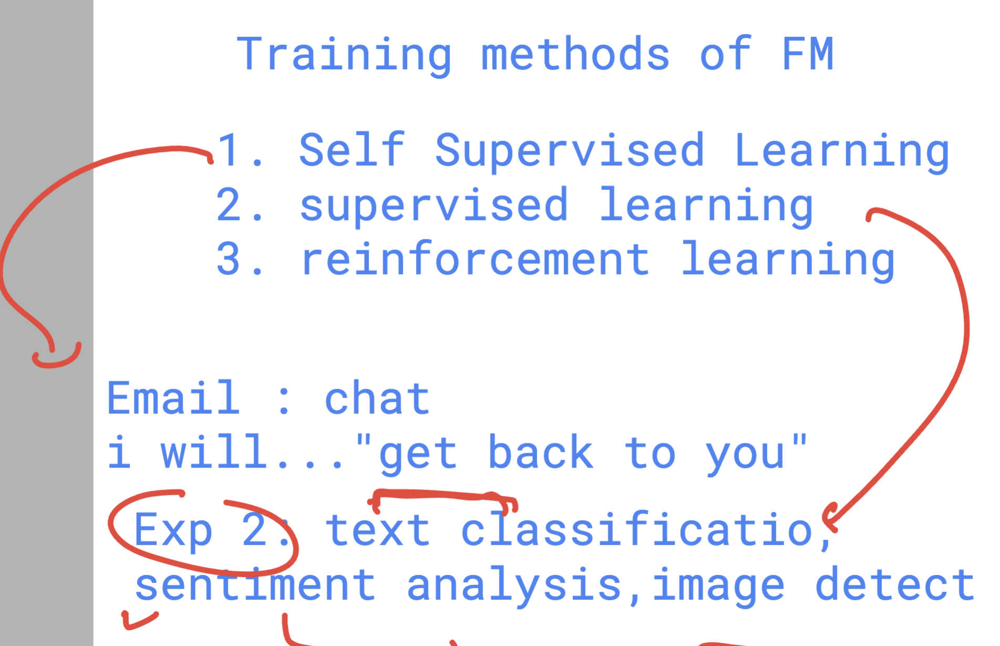
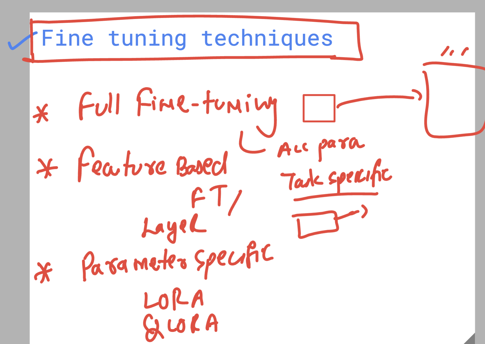
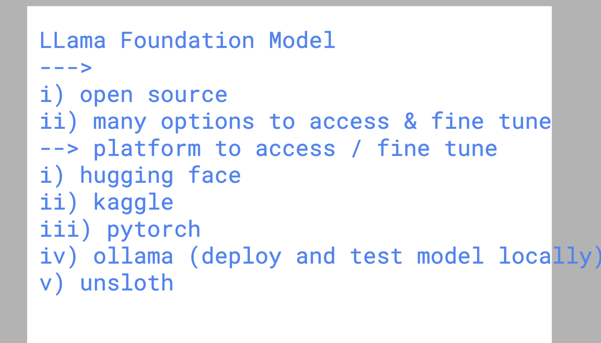
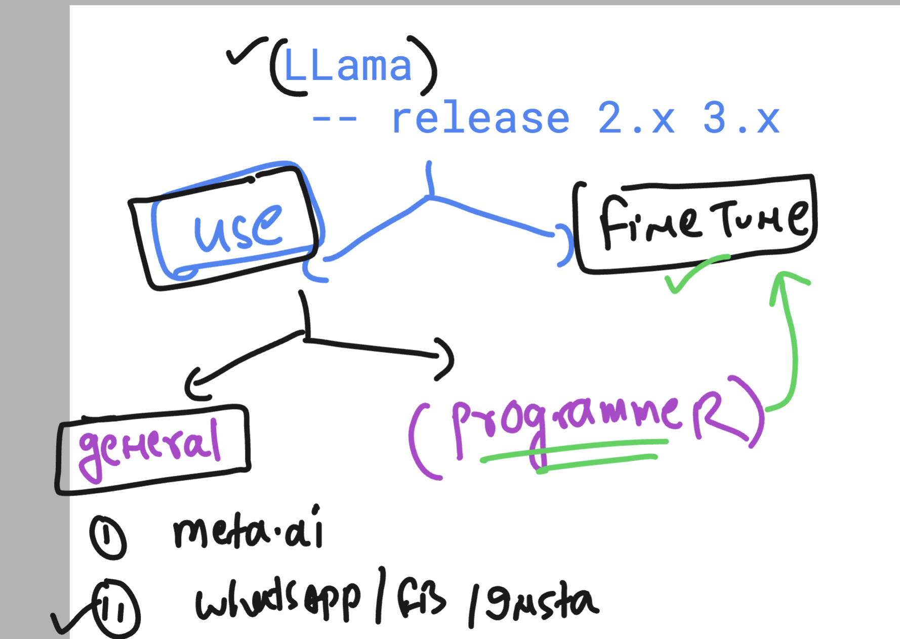
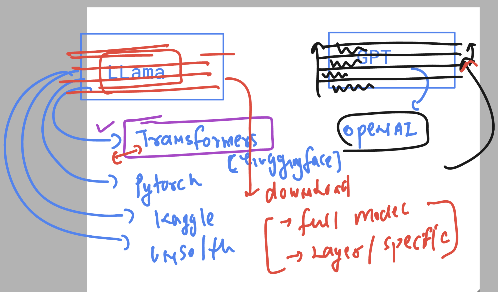
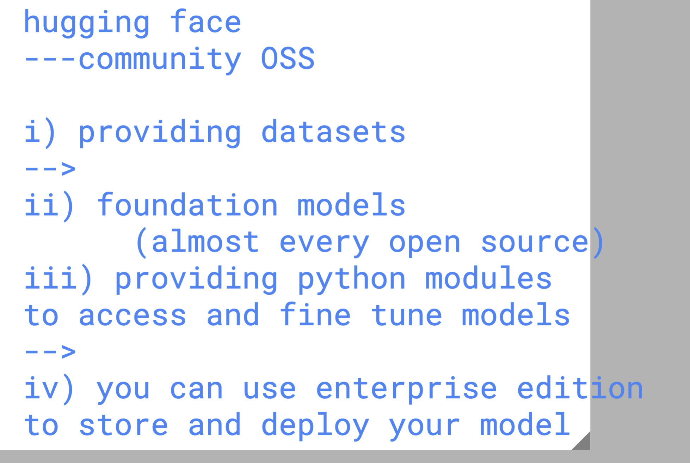
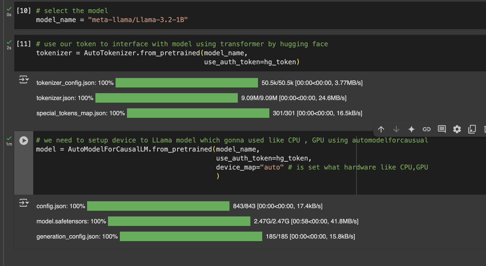

### Revision 

### Process of fine tuning of any Foundation model 

##  High Level Foundation model Fine tuning 

### Techniques to fine tune models

# INtro to LLama model 

### using llama in various places 

## accessing GPT vs LLama 

## Hugging face info 

### downloading llama model 

### to interact with llama model we need to choose pipeline 

[click_here](https://huggingface.co/docs/transformers/en/main_classes/pipelines)

# Fine tuning in foundation model updates (types of parameter)

# Types of Parameters in Fine-Tuning

**3 types of parameters we have**
- Hyperparameters
- Model parameters
- Specific Fine-Tuning Techniques Parameters

## Hyperparameters

### Learning Rate
- **Description:** Controls the step size at each iteration while moving toward a minimum of the loss function.
- **Impact:** Affects the convergence speed and stability of the training process.

### Batch Size
- **Description:** The number of training examples used in one iteration.
- **Impact:** Influences the training time and stability of the gradient estimation.

### Epochs
- **Description:** The number of complete passes through the entire training dataset.
- **Impact:** Determines how long the model trains and can affect overfitting or underfitting.

### Dropout Rate
- **Description:** The fraction of neurons to drop during training to prevent overfitting.
- **Impact:** Helps in regularizing the model by preventing co-adaptation of neurons.

### Weight Decay
- **Description:** A regularization technique that adds a penalty to the loss function based on the magnitude of model weights.
- **Impact:** Prevents overfitting by discouraging large weights.

### Learning Rate Scheduler
- **Description:** A strategy to adjust the learning rate during training.
- **Impact:** Helps in fine-tuning the learning process to achieve better convergence.

## Model Parameters

### Weights
- **Description:** Parameters that define the strength of connections between neurons in the network.
- **Impact:** Directly influence the output of the neural network.

### Biases
- **Description:** Parameters added to the weighted sum of inputs to the neurons.
- **Impact:** Allow the activation function to be shifted left or right, which can help in better fitting the data.

## Specific Fine-Tuning Techniques Parameters

### Layer-Specific Learning Rates
- **Description:** Different learning rates for different layers in the model.
- **Impact:** Allows more control over which parts of the model should adapt faster or slower.

### Adversarial Training Parameters
- **Description:** Parameters controlling the generation of adversarial examples (e.g., perturbation size).
- **Impact:** Influence the robustness of the model to adversarial attacks.

### Low-Rank Adaptation (LoRA) Parameters
- **Description:** Parameters for the additional low-rank matrices.
- **Impact:** Control the adaptation without changing the original weights significantly.

## Summary

Fine-tuning involves adjusting both hyperparameters and model parameters. Hyperparameters control the training process, including learning rate, batch size, epochs, dropout rate, weight decay, and learning rate scheduler. Model parameters, such as weights and biases, are the internal parameters that the model learns from the data. Specific fine-tuning techniques may introduce additional parameters to better control the adaptation process.

