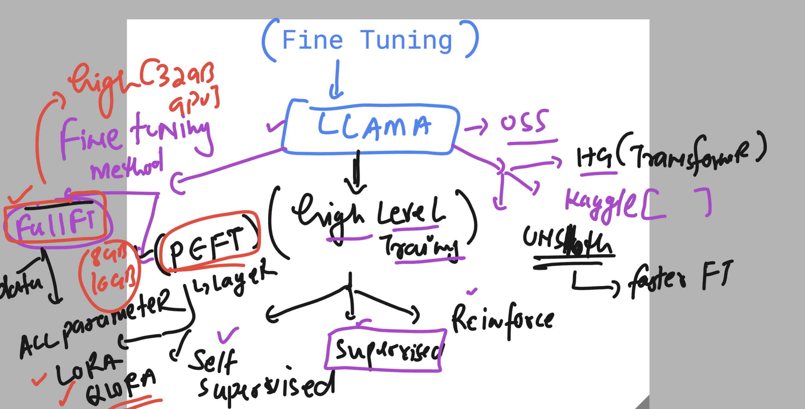
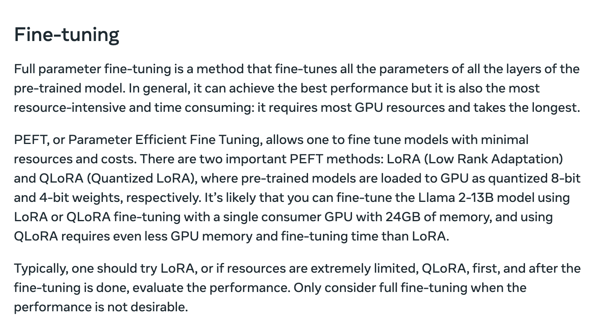
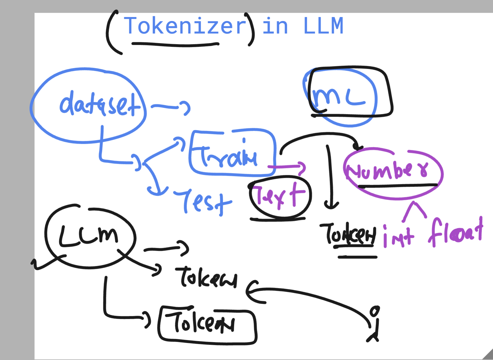

## Revision and understanding fine internals 

### Fine tuning using PEFT methods 

### Tokenization understanding 

### Quantization of LLM to run them on lower GPU resources 
### Using PEFT calles like LORA and QLORA

### INtro to RAG

