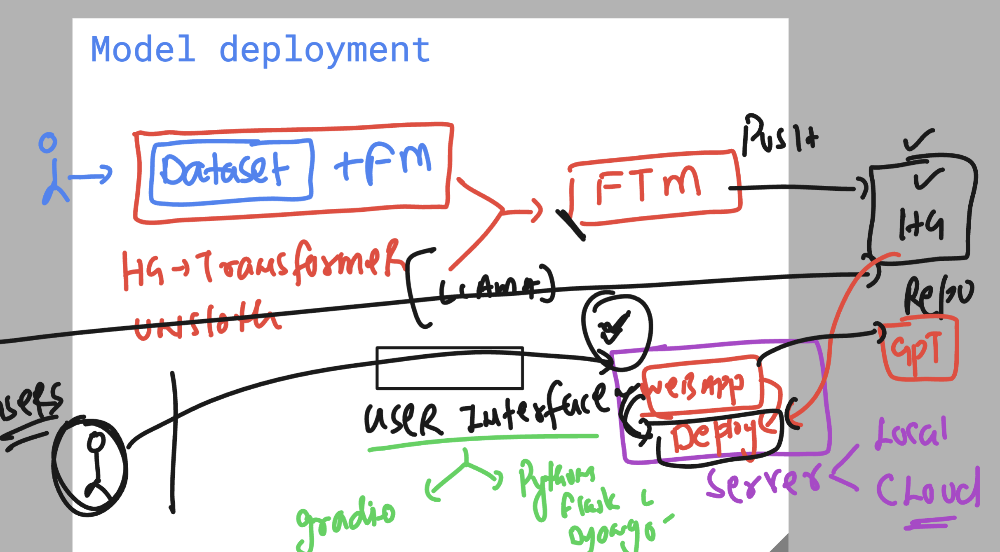

## Concepts of model deployment basics 



### Model deploy options 


### Installing libs

```
(ashu-env) ashu@ip-172-31-79-44:~/ashu_model_deploy$ ls
Flask_chatUI  ashu-env  query.py
(ashu-env) ashu@ip-172-31-79-44:~/ashu_model_deploy$ cd Flask_chatUI/
(ashu-env) ashu@ip-172-31-79-44:~/ashu_model_deploy/Flask_chatUI$ ls
app.py  requirements.txt  static  templates
(ashu-env) ashu@ip-172-31-79-44:~/ashu_model_deploy/Flask_chatUI$ pip3 install -r requirements.txt 
Collecting flask
  Using cached flask-3.1.0-py3-none-any.whl (102 kB)
Collecting openai==1.59.8
  Downloading openai-1.59.8-py3-none-any.whl (455 kB)
     ━━━━━━━━━━━━━━━━━━━━━━━━━━━━━━━━━━━━━━━━ 
```

